# PDMS Device Attempts

In pursuing smaller beads, I started producing PDMS devices. I used a dry film photoresist patterned onto a glass slide to make many PDMS devices. The glass slide was placed into a large petri dish and PDMS was poured over top. After curing at room temperature over night (or fast baked in an oven), the PDMS directly over the glass slide was cut out and removed.

## General Protocol

### High level summary:

- Create Dry Film Resist on a large glass slide. With double sided tape, attach to base of large petri dish
- Cover with PDMS, place under vacuum (to remove any bubbles) and let cure in the oven (~60°C x 1 hour) or overnight at room temperature
- After fully cured, cut out a piece of PDMS slightly larger than the glass slide and remove the piece
- Remove the edges and make sure the bottom surface is completely flat
- Carefully punch needle holes
- Tape the bottom to prevent the collection of dust particles. In general tape is your best friend to remove any particulate from a surface by peeling it off repeatedly

  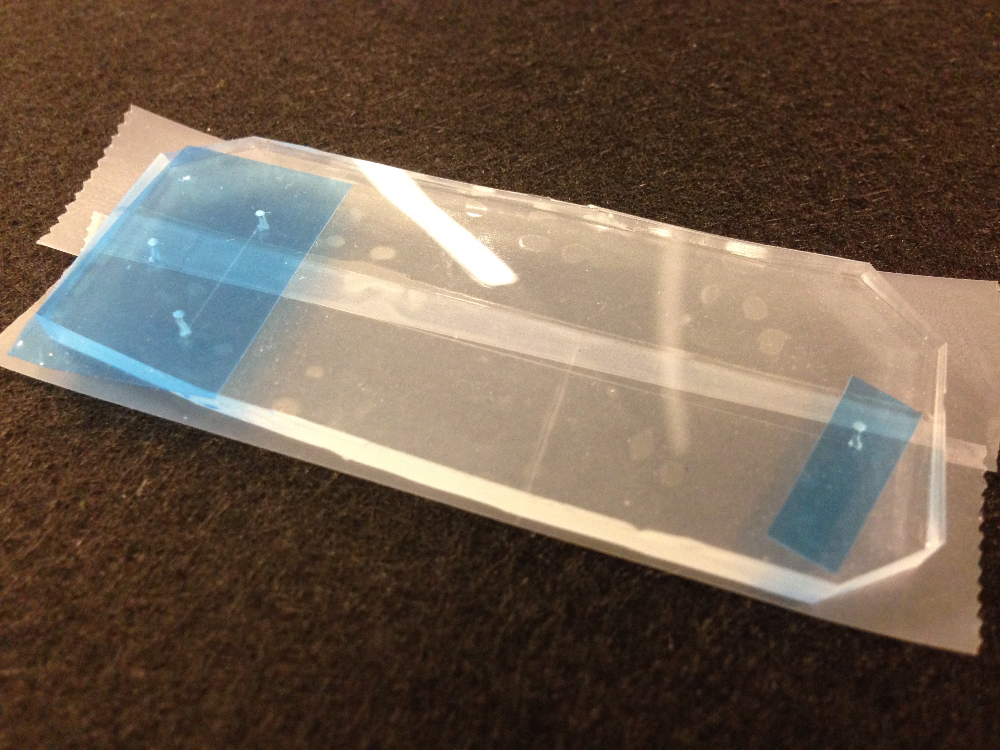

Taped and punched PDMS device ready for bonding

### Bonding

- Clean both the PDMS and glass slide with IPA then remove any dust with tape. Place both pieces face up in an Oxygen Plasma machine
	+ For the fab lab (the top loading one), the recipe is 0.7 torr, 6s, and 150 watts
- After exposed, remove both pieces and gently contact the appropriate surfaces. If needed, use a marker as a rolling pin to flatten out any bubbles. Place the newly bonded device on a hot plate (~100°C) to evaporate any leftover water

### Addition Of Needles

- Depending on the original hole punched, gently insert the metal needle.
	+ You may want to first bend the needle (for extra clearance around a microscope) or add the appropriate tubing
	+ Additionally, add a drop of water or oil tends to help prevent cracking when inserting a needle
	+ I used the Hamilton 21GA needles (500 µm) with the blue needle punch (0.5 mm) and tygon tubing - ID: 0.0075 in (OD: 0.080 in). Use the **blunt** 23GA (Orange) luer lock needles to connect a syringe
	+ Any cracks around the needle site can be a big issue - you may be able to add some partially cured PDMS, but epoxy won't work because it has such different mechanical properties and does not create a good bond.
- After this step you are ready to use the device

  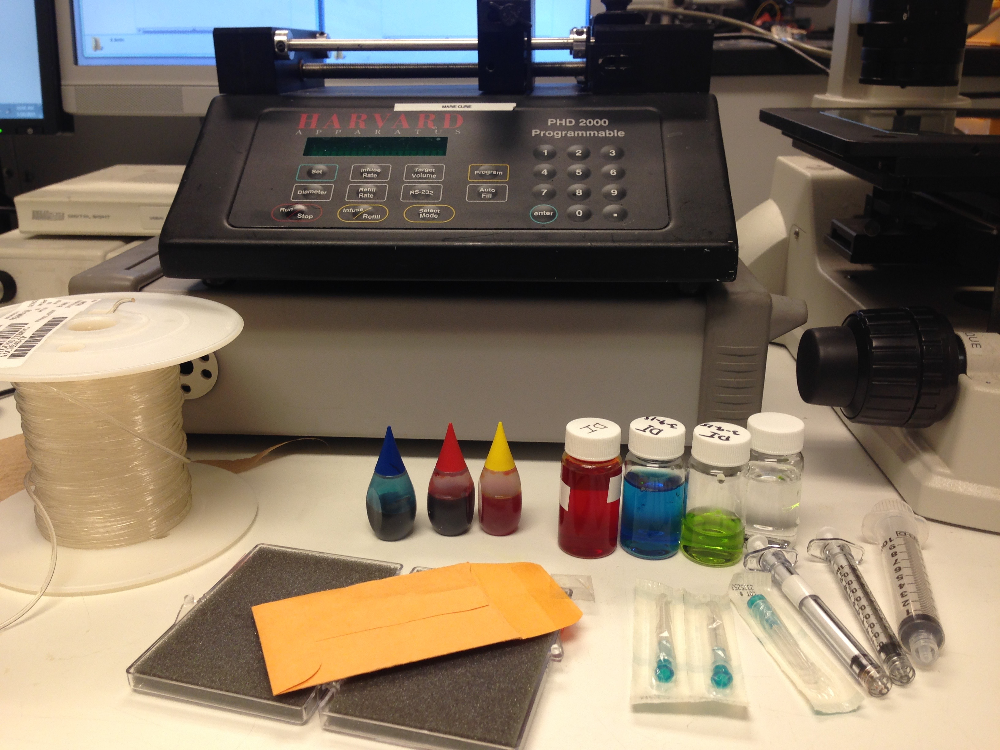

All my supplies

### *Variation: No Needle Approach*

Most of the time adding needles is relatively easy, but the burst pressure of the needle attachment is relatively low. I replicated an alternative approach that I found in literature ([Reusable, robust NanoPort connections to PDMS chips](http://blogs.rsc.org/chipsandtips/2008/10/08/reusable-robust-nanoport-connections-to-pdms-chips/)).

- Punch slightly larger holes in the PDMS before bonding (I used 1.2 mm punch and Cole Parmer 24 AWG Thin Wall Tubing)
- Separately, cut out a cylindrical piece of PDMS with a smooth base. Using the UV-Ozone in the MML cleanroom, bond the ring over the punched hole

  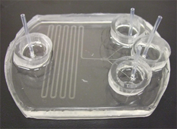

Example ring bonded around the punched hole - I couldn't find a picture of my own of this step

- Insert the tubing directly into the hole and pour partially cured PDMS over the tube and inside the outer ring. Then degas the freshly poured PDMS and place in the over for 30 minutes at 50°C.

  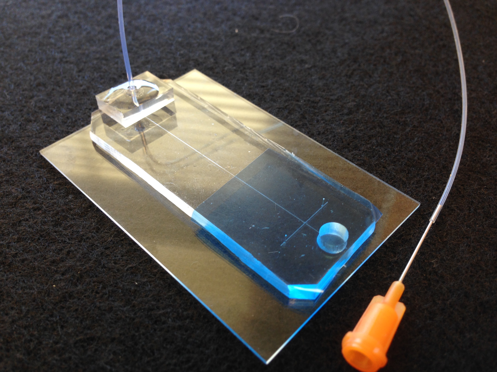

Finished junction

## Devices

I explored several options while making PDMS devices. I was locked into one microfluidic chip design due to Renee's mask, so I attempted to use heat control, better ports, and other techniques to achieve results. Ultimately, I moved onto PMMA devices which proved far more effective.

### Vacuum Chip

This chip was based on this paper ([A microfluidic device for on-chip agarose microbead generation with ultralow reagent consumption](http://www.ncbi.nlm.nih.gov/pmc/articles/PMC3482248/)). I tested several different reservoir sizes, flow ratios, and other parameters, but was never able to replicate the published paper.

  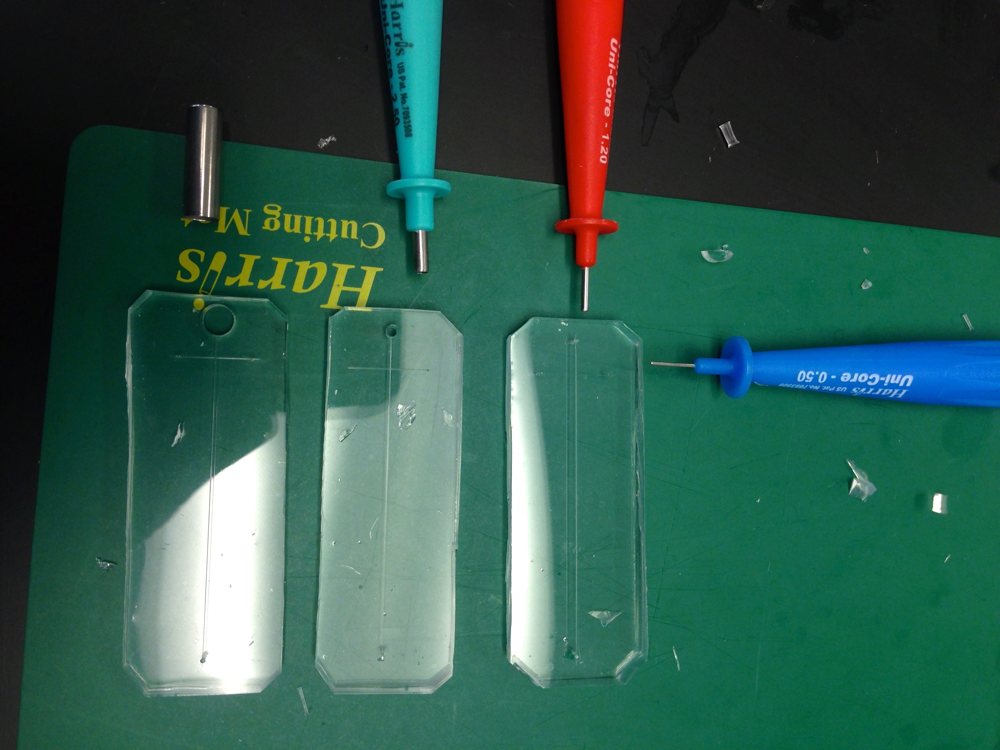

Different punches used to test reservoir sizes

  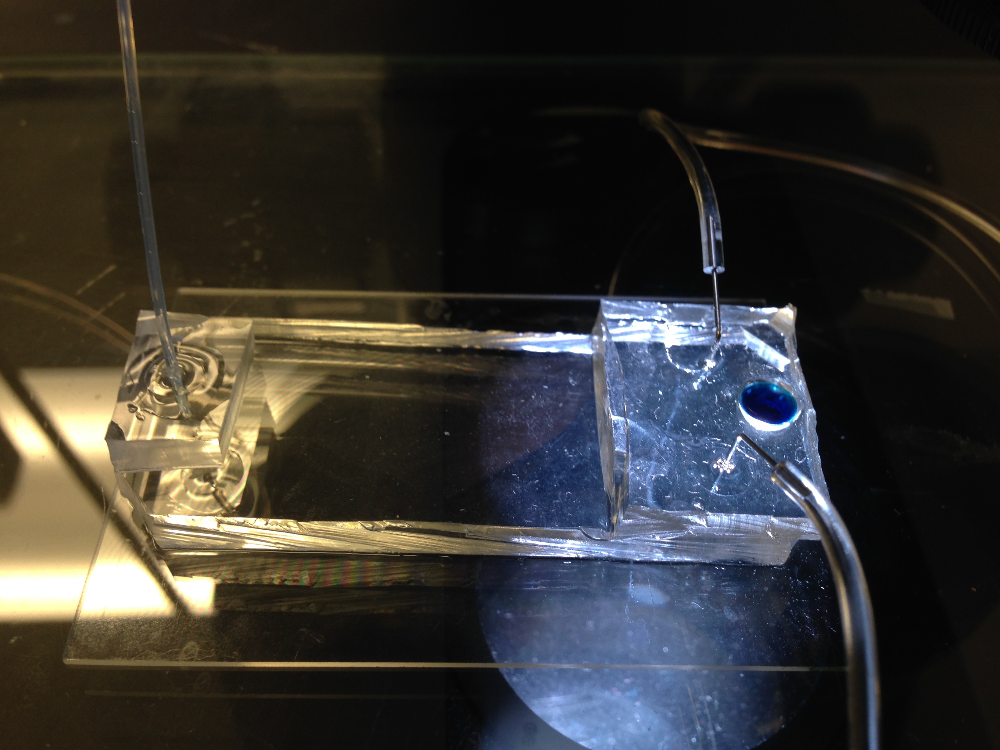

Example device

  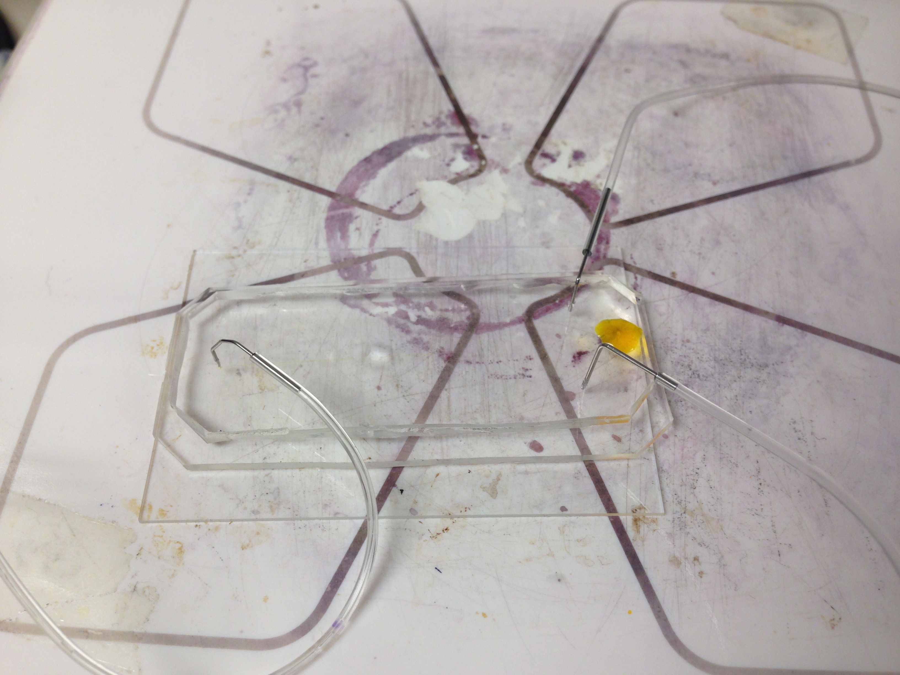

  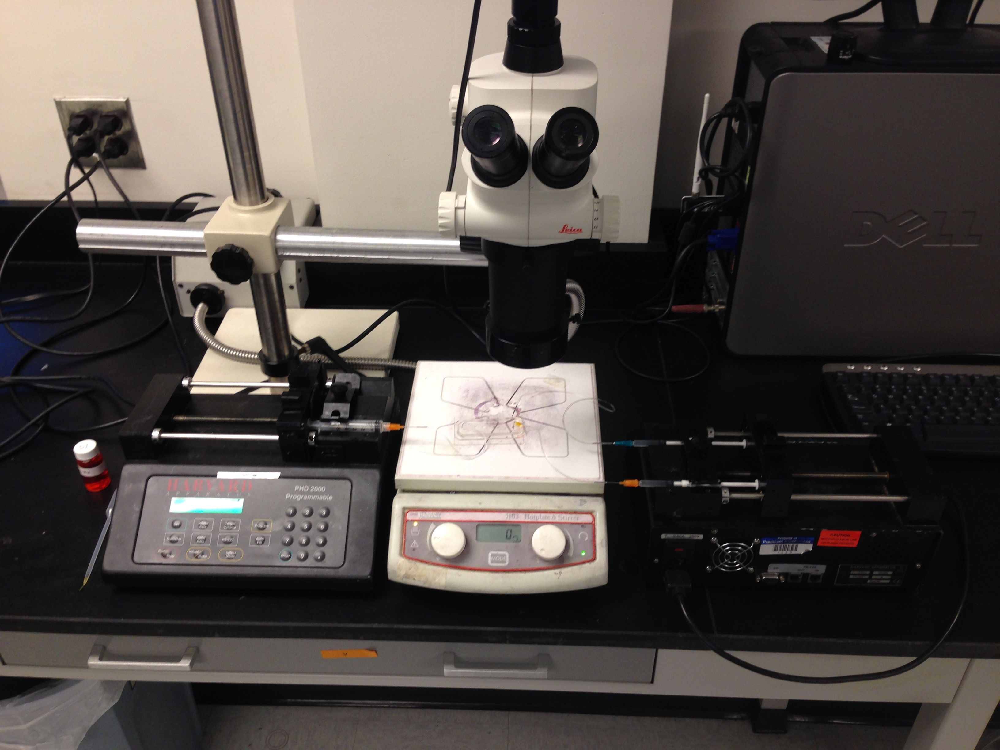

Another example device

### Positive Pressure Chip

Using a more standard approach, I attempted to create beads using positive pressure. I used a thermoelectric heater to heat the dead volume and collected the beads off chip in a petri dish. I was able to create beads with this approach but at very small quantities and after an hour, most chips would fail by clogging.

  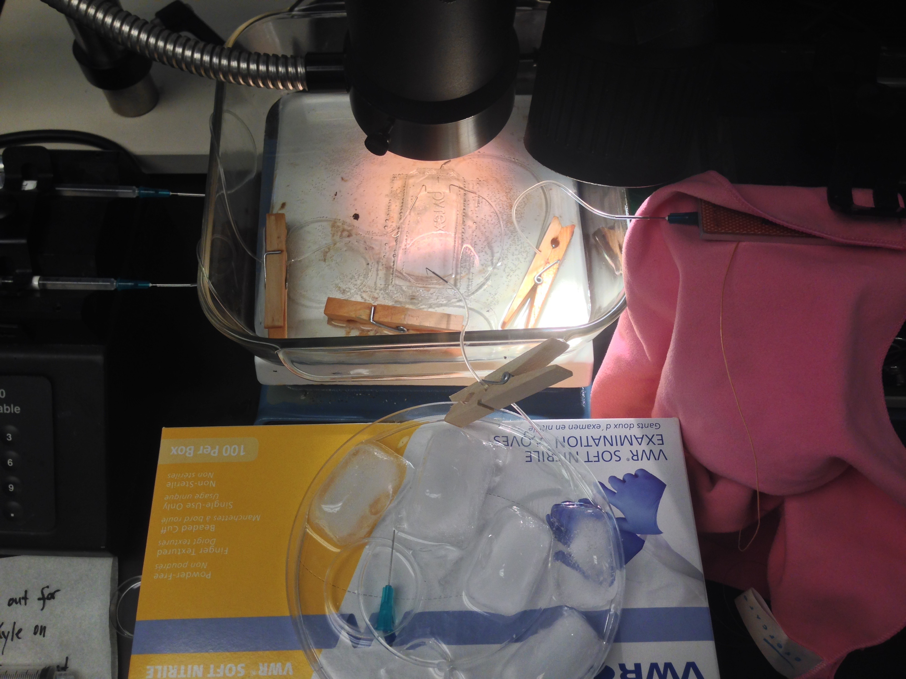

Example setup overview

  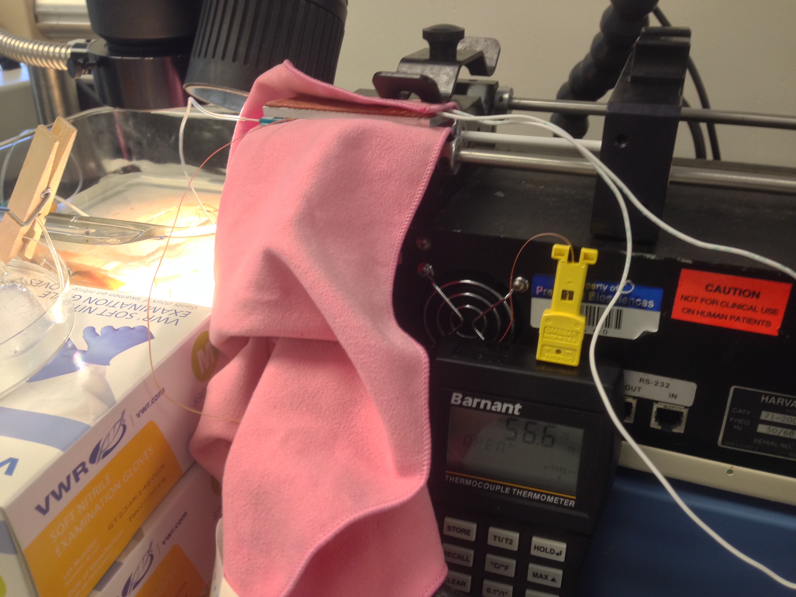

Simple heater for the syringe

  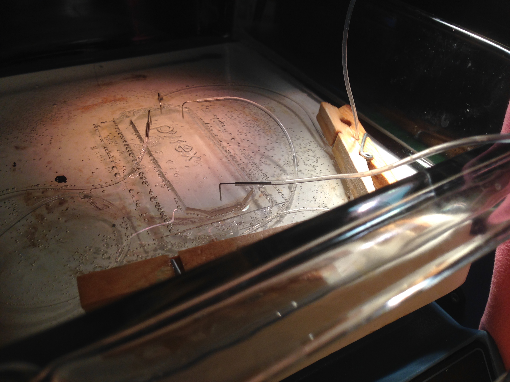

The chip was heated by submerging into a hot water bath

  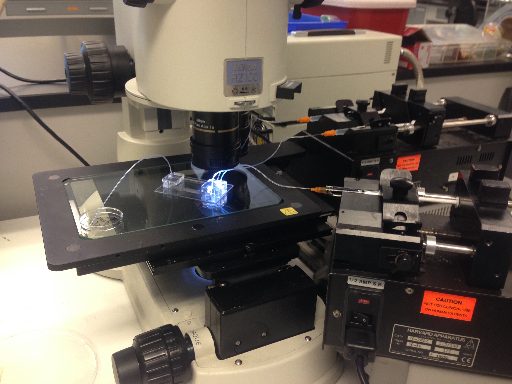

  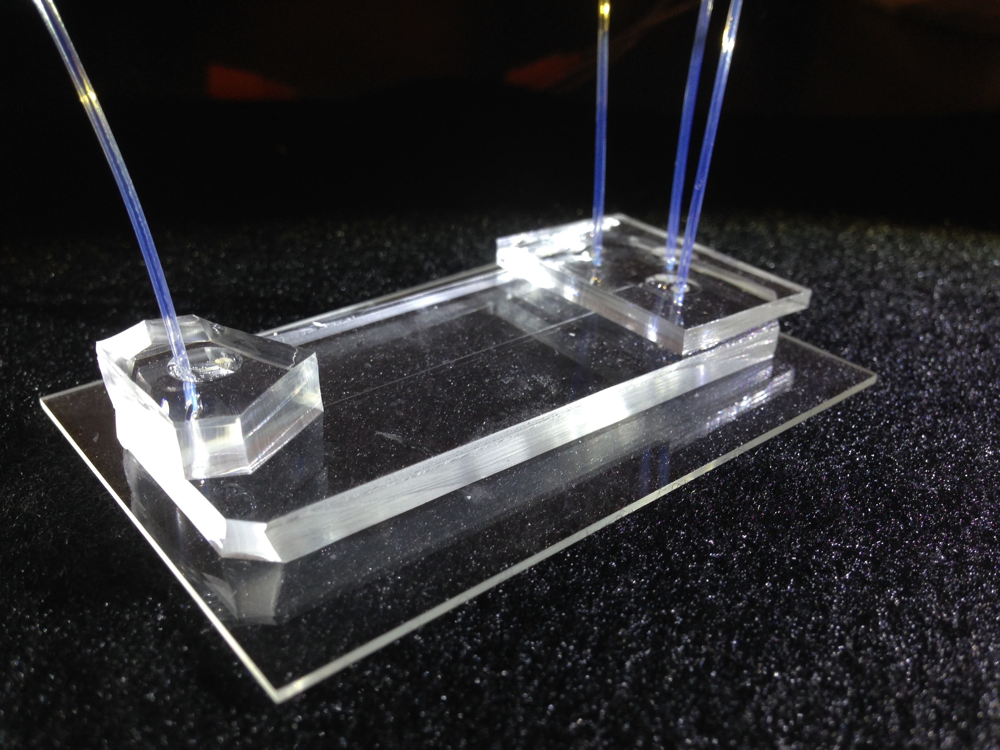

An example device using the direct-tubing approach

  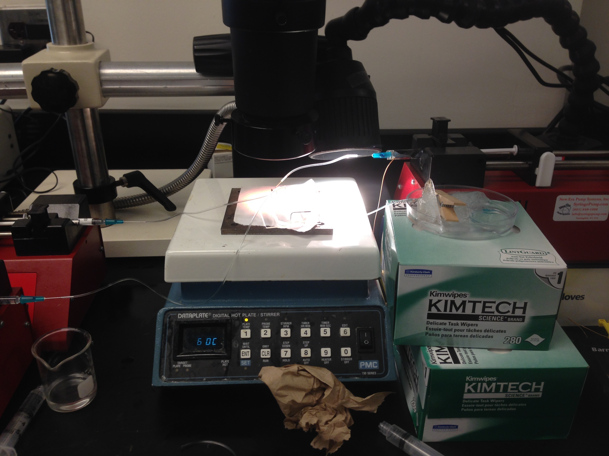

  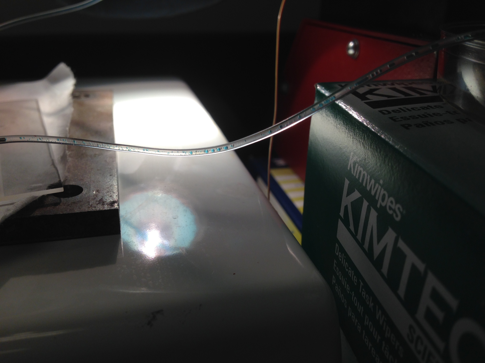

Example beads generated by a device

