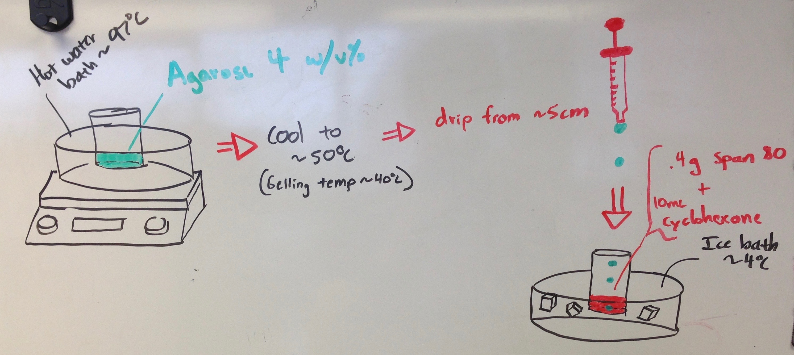
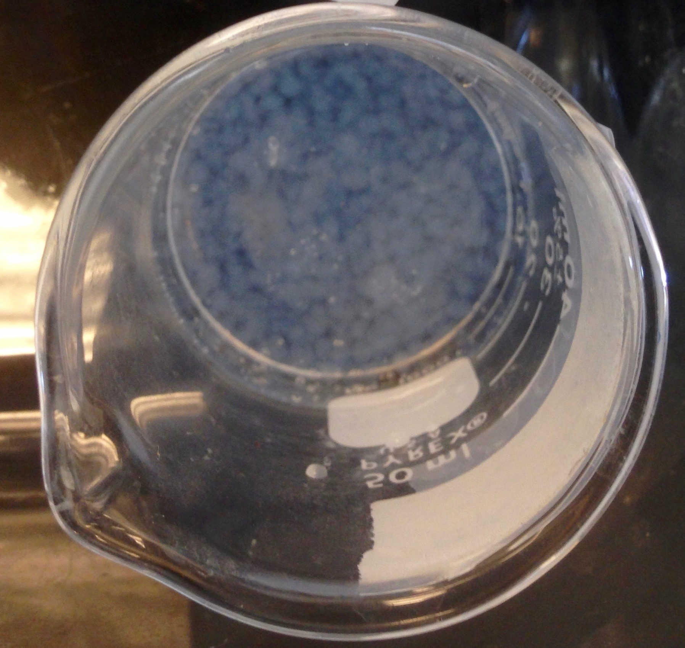
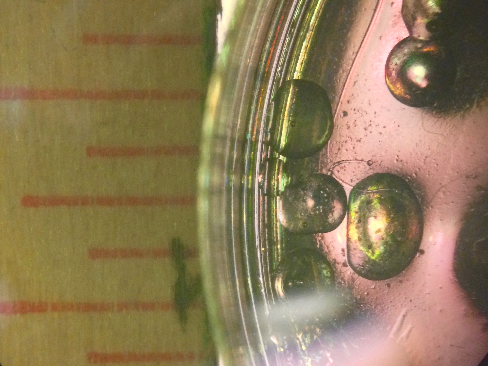

# Bulk Bead Generation

The most simple approach to agarose droplet generation:

**1% Agarose Mixture:**

- Using a 5ml glass beaker add 5g of DI
- Weigh out 0.05g of LMP agarose onto wax paper
- Microwave the glass beaker and water twice for 20 second intervals
- Add the agarose powder and microwave one additional time of 20 seconds
- If not completely dissolved mix with a pasteur pipette
- Make sure to keep warm until ready for use (can place in oven)

**Silicone Oil (or Mineral Oil) with 2% w/w Surfactant (Span 80)**

- Add a specific mass of surfactant to oil
- The tricky part is mixing. You don't want to introduce bubbles, so I just mixed with a plastic pasteur pipette
- Additionally the span 80 is very viscous, so I would prefer to dilute it to a first container with my chosen oil

  
  <!-- <figcaption style="text-align: cener;">Whiteboard sketch of the bulk bead generation process</figcaption> -->

Whiteboard sketch of the bulk bead generation process

From a pipette or capillary, drip the hot agarose mixture into a beaker of silicone oil. Additionally, you can place the beaker of oil into an ice bath to quickly cool the beads.

  
  <!-- <figcaption style="text-align: cener;">Beads in oil after following the above process</figcaption> -->

Beads in oil after following the above process

  
  <!-- <figcaption style="text-align: cener;">The beads varied greatly, but were around 2.5 mm (0.1 in) in diameter</figcaption> -->

The beads varied greatly, but were around 2.5 mm (0.1 in) in diameter

