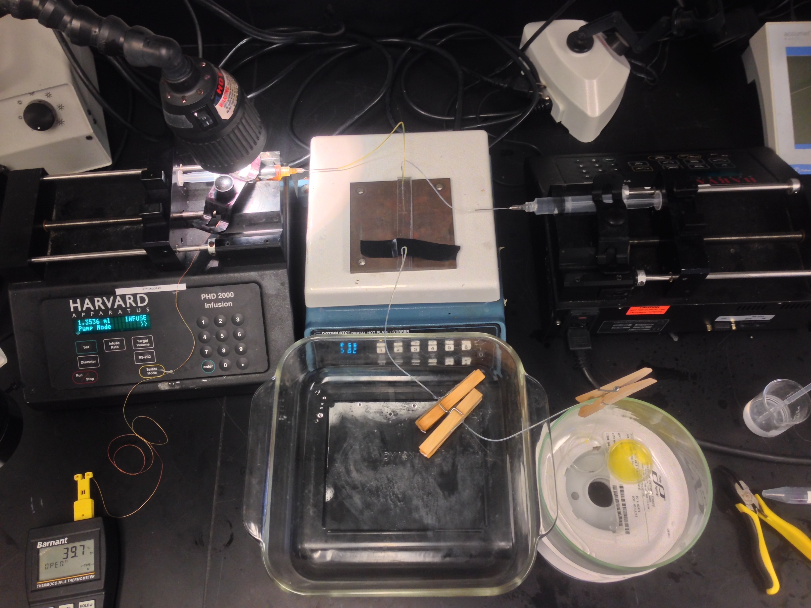
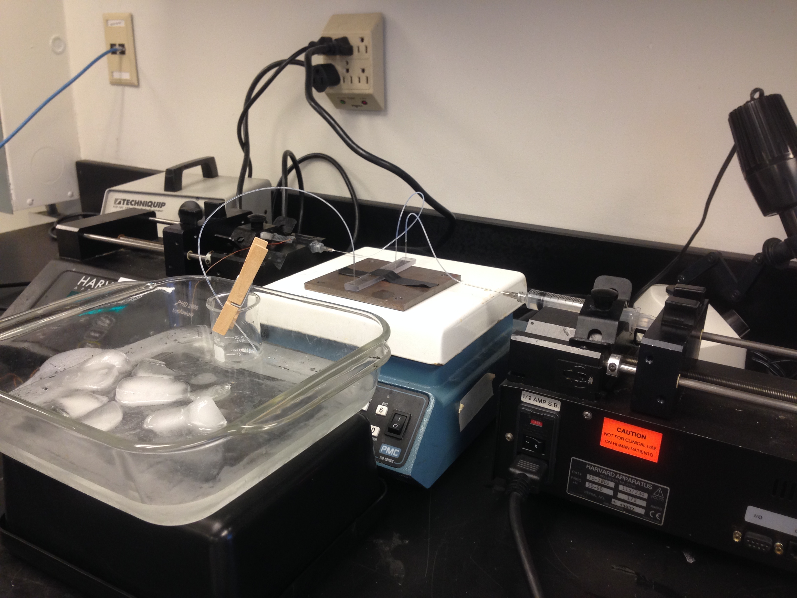
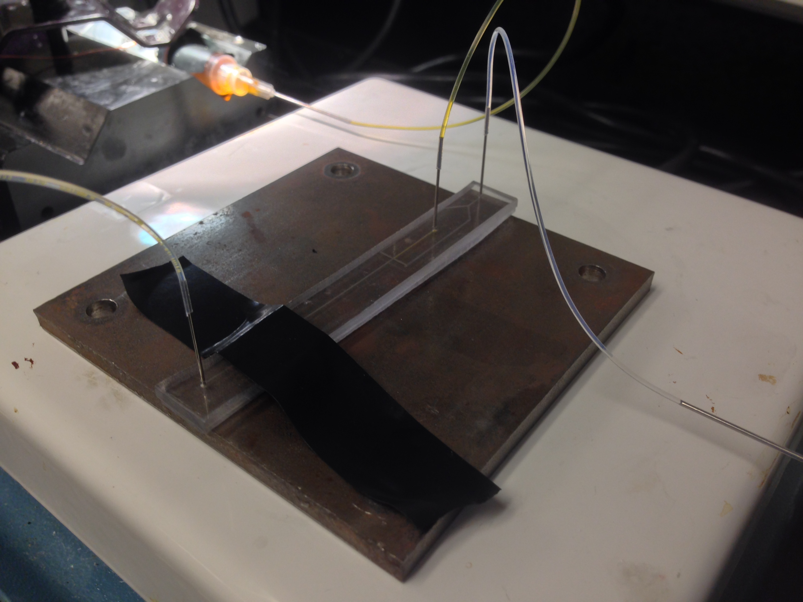
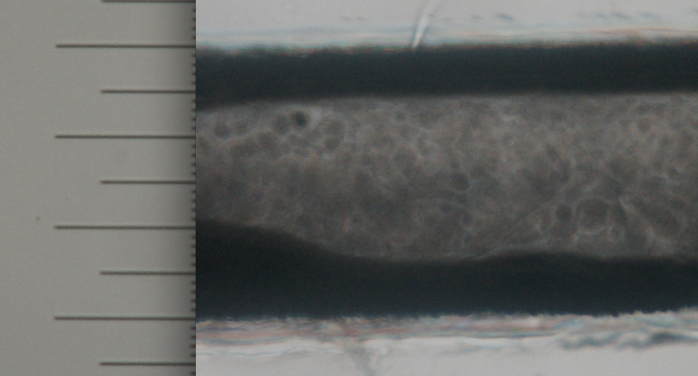
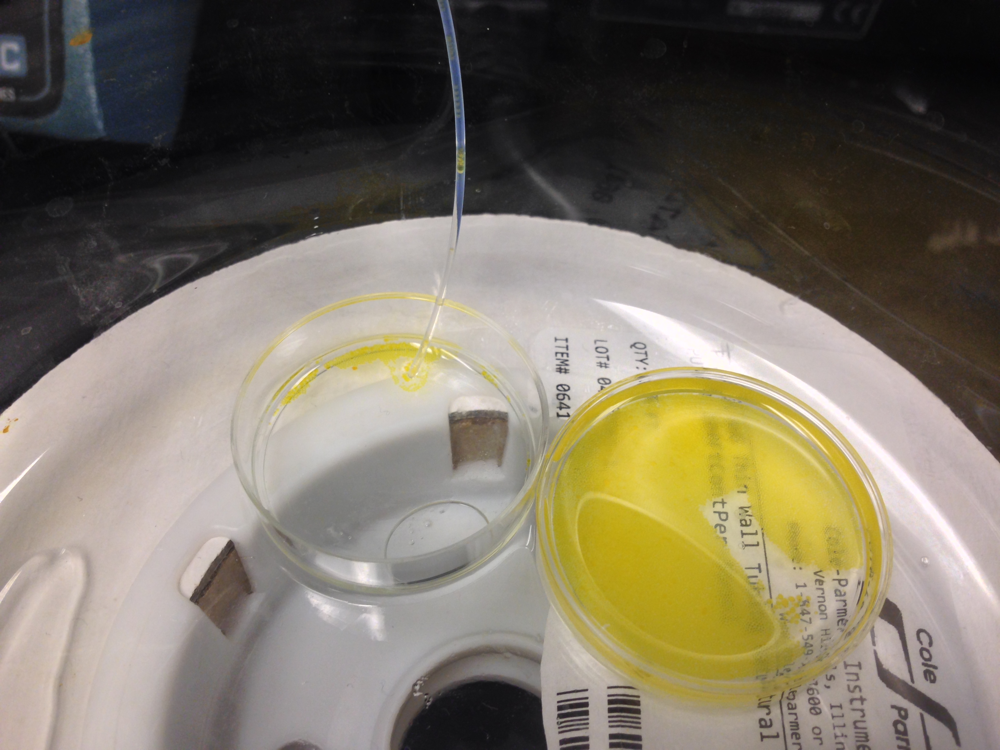
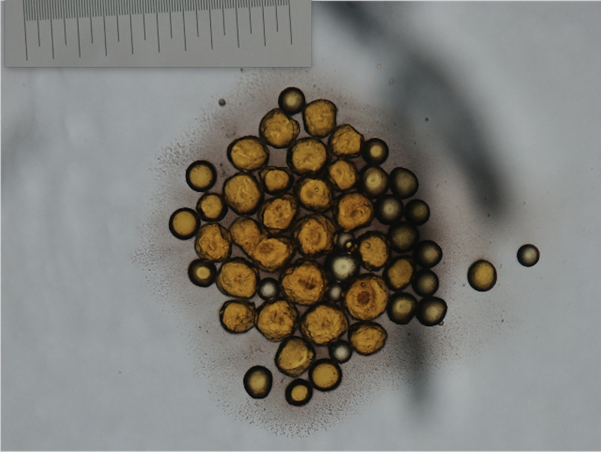

# Inherited PMMA Chip Test

Using chips left over from KJ's work, I setup a heated platform on a hot plate and collected the beads in an ice bath. The experiment went very well and proved very promising. After this success, I attempted to make the beads smaller and to produce greater quantities using PDMS devices.

  
  <!-- <figcaption style="text-align: center;">The complete setup</figcaption> -->

  

The complete setup

  
  <!-- <figcaption style="text-align: center;">A metal plate was used to maintain a more constant temperature</figcaption> -->

A metal plate was used to maintain a more constant temperature

  
  <!-- <figcaption style="text-align: center;">The device channel was 300µm wide</figcaption> -->

The device channel was 300µm wide

  
  <!-- <figcaption style="text-align: center;">The beads were collected in a petri dish at room temperature after traveling the length of the exit tube</figcaption> -->

The beads were collected in a petri dish at room temperature after traveling the length of the exit tube

  
  <!-- <figcaption style="text-align: center;">The generated beads were roughly ~100µm in diameter (the scale bar is 1mm)</figcaption> -->

The generated beads were roughly ~100µm in diameter (the scale bar is 1mm)

