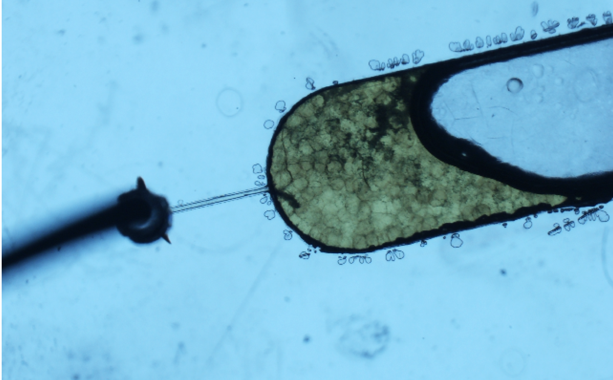
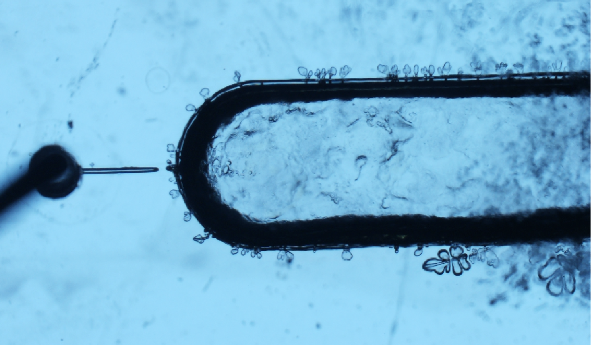

# Melting Tests (Proof of Concept)

Both of the melting tests showed that possibility of this approach to optical improvement.

## Bulk Demonstration

The bulk beads were placed into large PDMS wells. The beads melted around 80°C, which is below the glass transition temperature of PMMA and COC. Even with one bead, the optical improvement is visible.

Download the complete video: `MeltingLMPGel.mp4`

## Miniature Beads

The beads produced from the PMMA device were loaded as a bead bed. Notably the beads were difficult to pack. I initially attributed the difficult to clogging in the exit channel and the lack of concentrated beads; however, this may have been the beads collapsing in the channel under the static pressure. Additionally, the water boiled off of the device as you can see the food dye flow out the entrance. Make sure to purge the bead bed before melting.

  
  <!-- <figcaption style="text-align: center;">The bead bed before melting step (see video: `PMMA Device Beads/Melting.mov`)</figcaption> -->

The bead bed before melting step (see video: `PMMA Device Beads/Melting.mov`)

  
  <!-- <figcaption style="text-align: center;">The bead bed after melting step</figcaption> -->

The bead bed after melting step

See the complete video: `BeadBedMelt.mp4`
