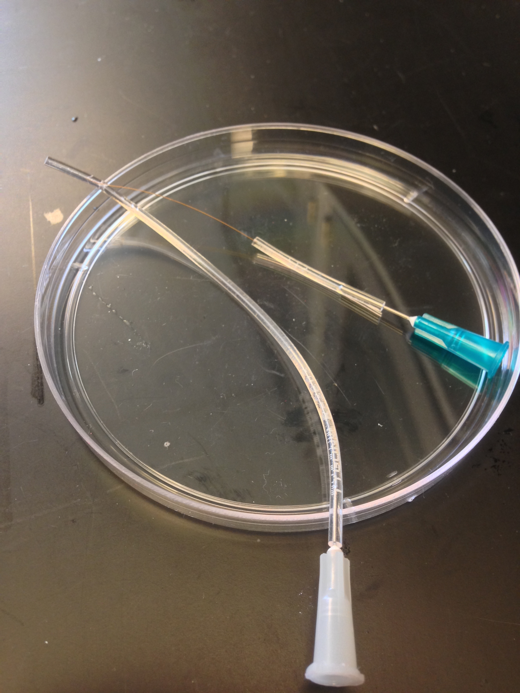
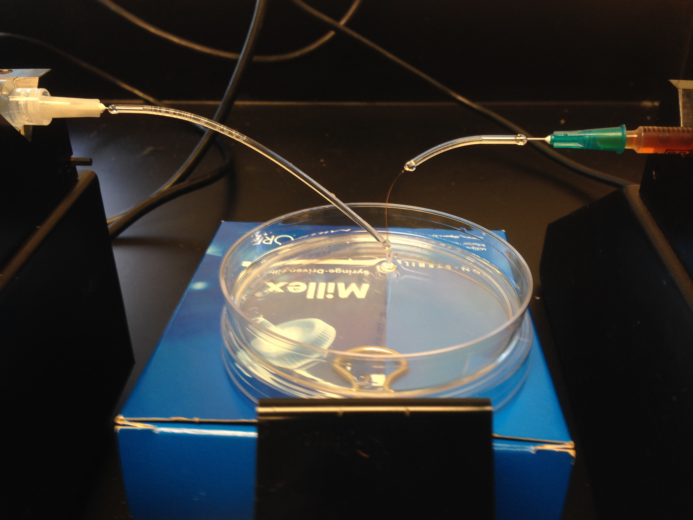

# Capillary Device

In an attempt to make even smaller agarose beads, I built a simple coflow droplet generator using a glass capillary inside of a teflon outer tube. I struggled with clogging and quickly moved onto PDMS devices using a mask provided by Renee Hood.

  

  

