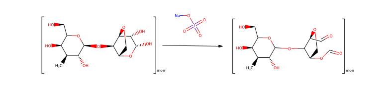

# Chemical Activation

I did a pretty wide literature review and settled on two approaches. The first was a formaldehyde sensor, which I liked the simplicity, but when heated the reaction progresses so it just blackens and any optical improvement is obscured. The second approach using a hydrazide was far more effective. I made a proof of concept demonstration using bulk beads (~1 mm diameter). All videos are hosted on [Dropbox](https://www.dropbox.com/sh/26z5iqn5fn9qsed/AAA62LBK2Unh6xyBEQ7XUGk5a?dl=0) and on the Mantis post under `6_Chemical-Activation`.

## Agarose Formaldehyde Sensor

  

I demonstrated concentration dependence over an arbitrary range

  

Then I setup to do a melting demonstration. Before the melt the beads were a light brown color

  

However, after melting the color became a burnt black. The heat had driven the reaction to completion

See the complete video: `formaldehydemeltvideo.m4v`

## Agarose Direct Assay / Sandwich Immunoassay

The agarose beads are incubated with sodium periodate, then a streptavidin-hydrazide complex, leaving two active streptavidin sites per monomer for biotin-avidin binding.

  

Reaction 1

  

Reaction 2

For more specifics, refer to the entire protocol: `2_Hydrazide-Reaction/ElicellProtocol.pdf` or the two related papers: [EliCell assay for the detection of released cytokines from eosinophils](http://www.sciencedirect.com/science/article/pii/S0022175903000760) and [EliCell: a gel-phase dual antibody capture and detection assay to measure cytokine release from eosinophils](http://www.sciencedirect.com/science/article/pii/S0022175900002647)

# Demonstration

I demonstrated the Hydrazide-activation assay using a direct assay (the exposed streptavidin on the agarose beads - biotion/gold). The visible rosy red color is from the gold nanoparticles. After heating there is an optical improvement and the color difference is visibly noticeable between the controls.

  

Analysis

  

The beads used were from agarose poured into the plate below and then scraped off (Macro-Scale Bead Plate)

  

PDMS Wells - the beads were then placed into this PDMS plate bonded to a glass backing for analysis

