# PMMA Droplet Generator Devices

After some success with the PDMS devices, I explored alternatives using CNC-milled PMMA. This is a short summary of the considered designs and relative success of each. All videos are hosted on [Dropbox](https://www.dropbox.com/sh/uwgt93g2pvy5zed/AADoT59xlFzMaq7dk1BPQNjNa?dl=0) and on the Mantis post under `7_PMMA-Droplet-Generators`.

## General Overview

The devices were milled on the CNC and the included g-code files will make producing additional chips very easy.

  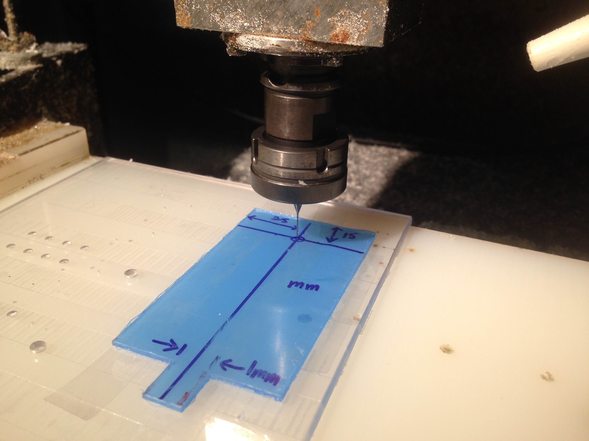

Aligning the CNC

Generally, my process:

- Milling
    + Cut a PMMA chip to 50mm x 100mm and cut a notch at the end (the PMMA with the blue protective tape)
    + Cut a second PMMA piece to the same dimensions, but with the thinner PMMA stock material (brown protective tape).
    + Sand down the edges of the PMMA and de-bur to make sure the material will sit level on the CNC
    + (Have someone operate the CNC for you using the included G-Code files along with your modifications)
    + Plan ahead to reserve the crushinator (hot press)

  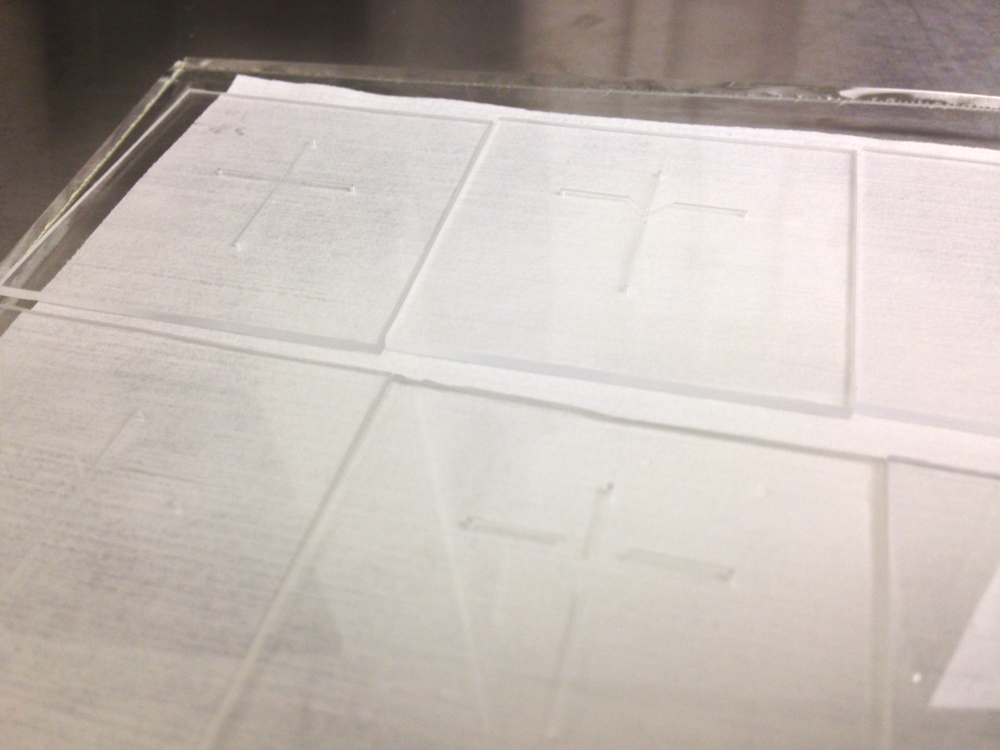

Freshly milled devices ready for bonding

- Bonding
    + Once beautifully-well cut, clean the device with IPA, Methanol, DI, and nitrogen dry. Then place in the cleanroom ovens overnight (70°C)
    + The next day, prep for bonding both pieces of PMMA
    + Set the Hot Press to 85°C and let it heat up
    + Collect two of metal plates, red rubber sheets, and clear teflon sheets that are larger than the PMMA device. You will then sandwich the device between these three layers
    + Go into `Manual` mode and configure these Hot Press settings:
        * a pressure equal to the surface area of the PMMA device (in inches) times 500 lbs/sq. in
        * 35% pump speed
        * (the time will be 15 minutes)
    + Once the hot press is nearly hot enough, put both pieces of the PMMA device face up in the UV-Ozone for 10 minutes
    + Place the PMMA device together and carefully align it inside the sandwich of Metal/Rubber/Teflon/Device/Teflon/Rubber/Metal inside the crushinator
    + Press for fifteen minutes
    + Once done, you will need to cool the device (**important**). If not, the device will warp irreparably
        * First turn the set temperature from 85°C down to about 20°C or so (this will allow you to monitor the temperature in real time)
        * In Manual mode, tun on the water cooling setting
        * Wait about ten minutes until the crushinator registers a temperature close to room temperature (keep in mind that the chip will be hotter than the displayed temperature)
        * Purge the water cooling system with air (in manual, turn off water and turn on air)
        * Remove the bonded chip and inspect under the microscope, if it looks good cover the needleports with blue tape. Place in a petri dish and let sit at room temperature over night for the material stresses to relax
- Needle Press
    + This is tricky and you will need to ask for someone to demonstrate the process. You will attach the fresh needle to the drill press and carefully insert it into the PMMA device. I used 22 gauge needles
    + Tips
        * If the needle touches the bottom plate of the PMMA device, your inlet will clog
        * Go slowly and accurate or you make create spiderweb cracks around the inlet. Small ones are okay and can be covered with epoxy, but will limit the life of the device
        * Make sure the needle is straight in the chuck (you can test by manually spinning the drill)
        * A trick from Eric, while rotating the needle, drag it along a piece of sand paper to round off the tip of the needle
        * With the dedicated microscope, align both the needle and port with the focal point
    + Once the needles are pressed, cover the connection with epoxy for better stability and attach your fluidic connections

  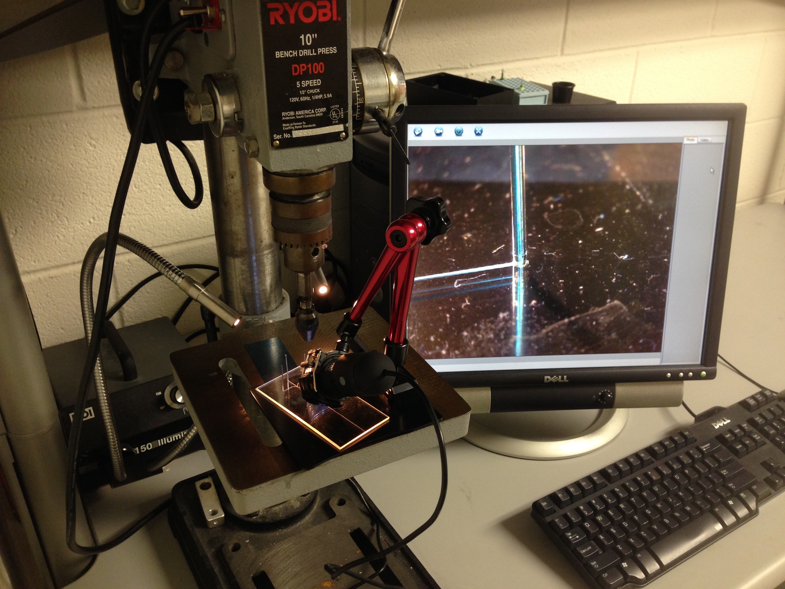

Pressing needles while using the USB microscope (replaced in favor of the dedicated microscope once Dr. Eric Kendall fixed the mounting hardware

## Evolution of the PMMA Devices

After some success with the PDMS devices, I designed a simple PMMA device that was 50mm x 50mm and nice large features that were easy to mill. The most important feature was the droplet generator section which was 150 µm  (width) by 40 µm (depth). After testing the device to produce agarose droplets, I moved onto producing agarose beads. I faced far fewer clogging issues and generated far more consistently sized beads for longer. I continued to extend the device capabilities by adding a heating element as shown in `8_Turtlebot` folder. See videos of the device operation on [Dropbox](https://www.dropbox.com/sh/uwgt93g2pvy5zed/AADoT59xlFzMaq7dk1BPQNjNa?dl=0) and on the Mantis post under `7_PMMA-Droplet-Generators`.

  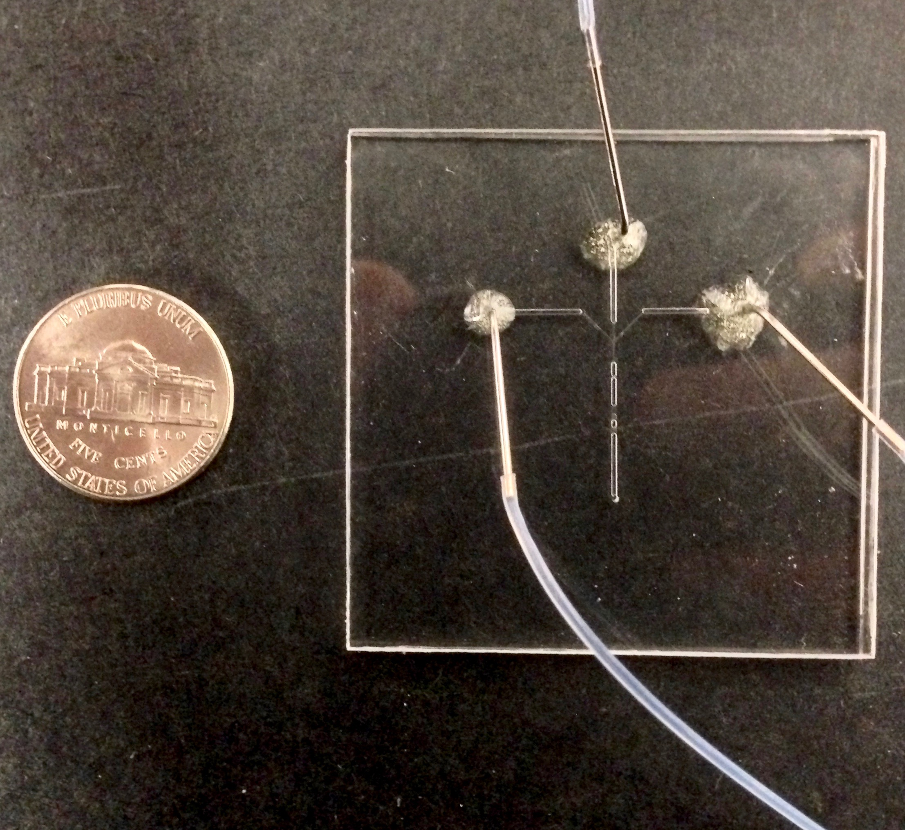

Early PMMA Device

  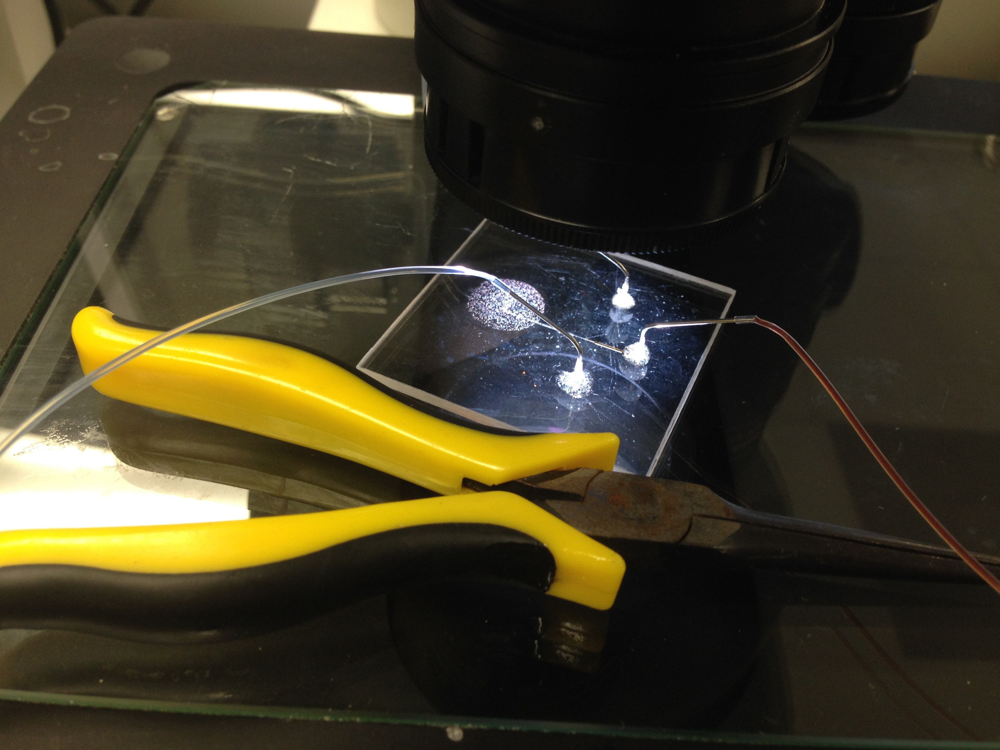

  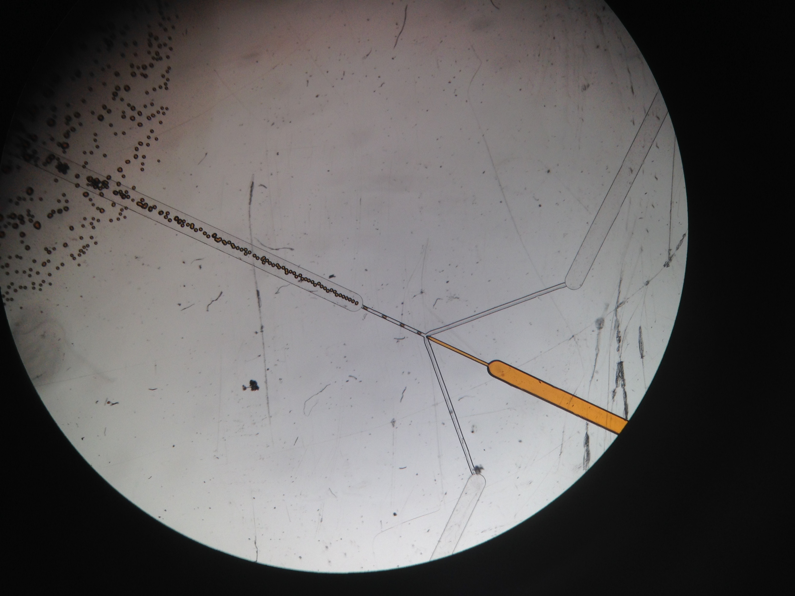

Water Droplet Production

Realizing one of the major drawbacks was beads colliding and coalescing together, especially around the exit port, I designed the chip to exit directly into solution. Additionally, the chip was longer to allow the beads to be cooled while still on the PMMA device.

  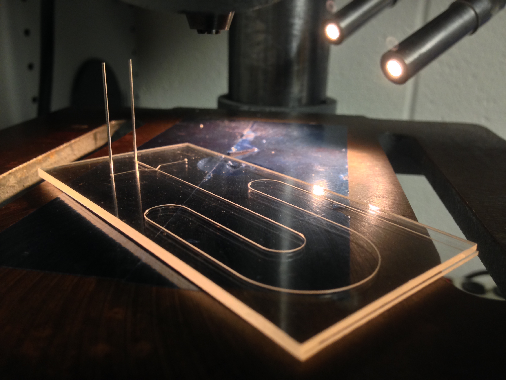

Extended channel length variation

  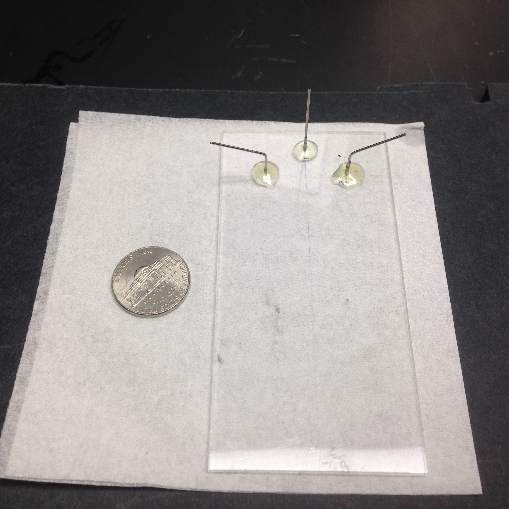

The longer PMMA Device

  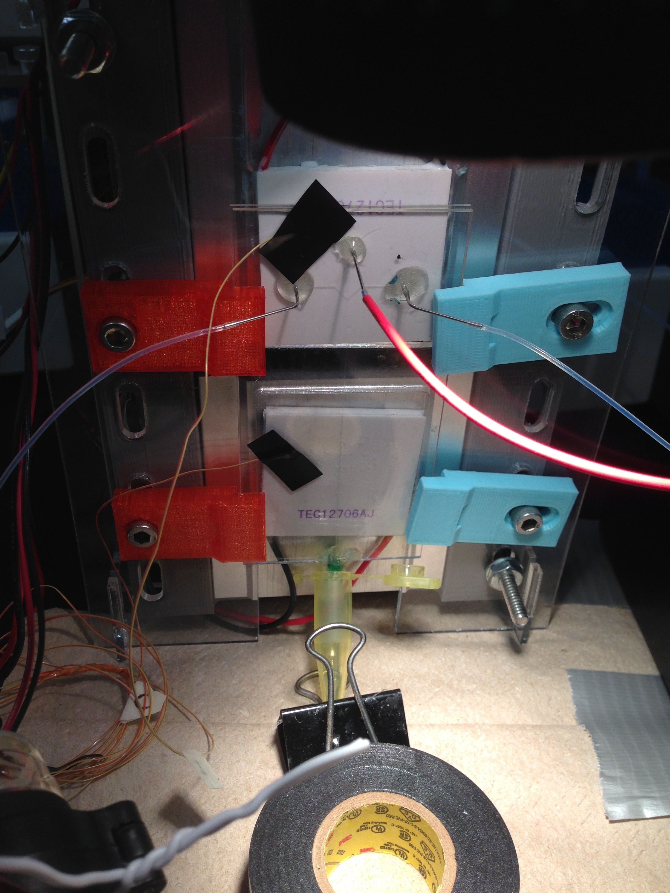

  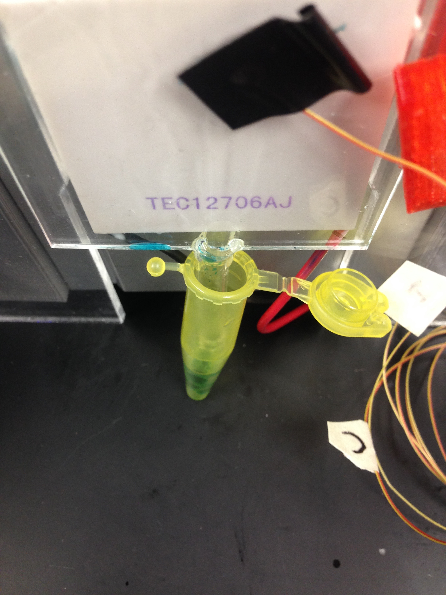

Slight after-market modification to collect the beads

  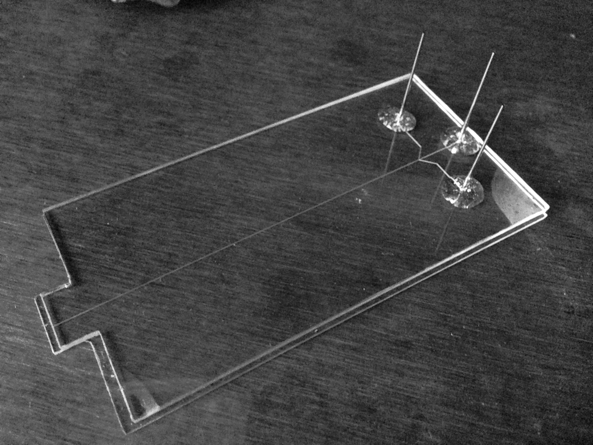

  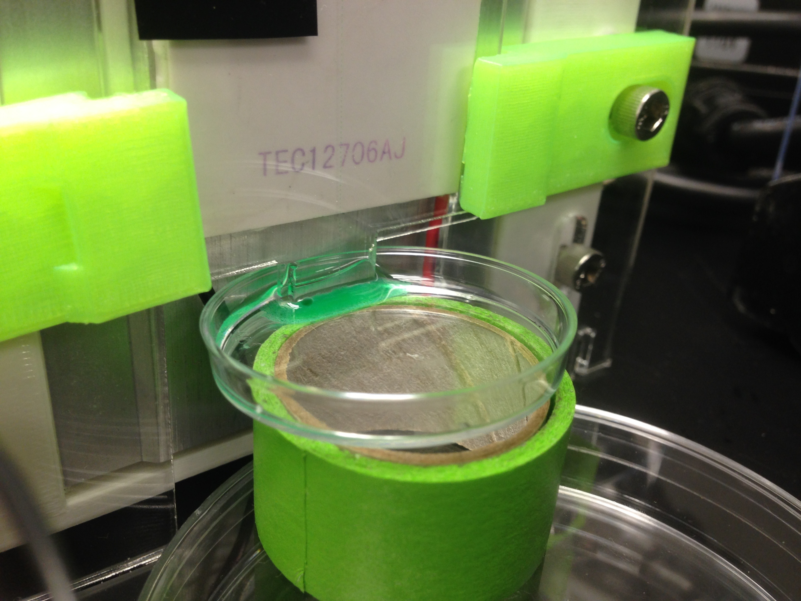

Final version with cutout to submerge in a mini petri-dish
