# Turtlebot (dual heat stage) and Melter (single heat stage)

I had too much fun working on the Raspberry Pi and building this device that I got sidetracked from the actual project. At this point this device should be entirely self-contained and can be modified however you need to. There are three parts. first the CAD for the 3D printed parts (`see 6_CAD-Files`). Second, the electronics, which are described in more detail under the folder, `5_Electronic-Diagrams`. Third, the code, see `4_Software/MML-HeatStage` for instructions and additional information. This README will only cover the history of the device and some setup pictures for reference.

## Manually Controlled Version

This version was the first demonstration and was kluged together. The device worked surprisingly well, but needed constant oversight.

  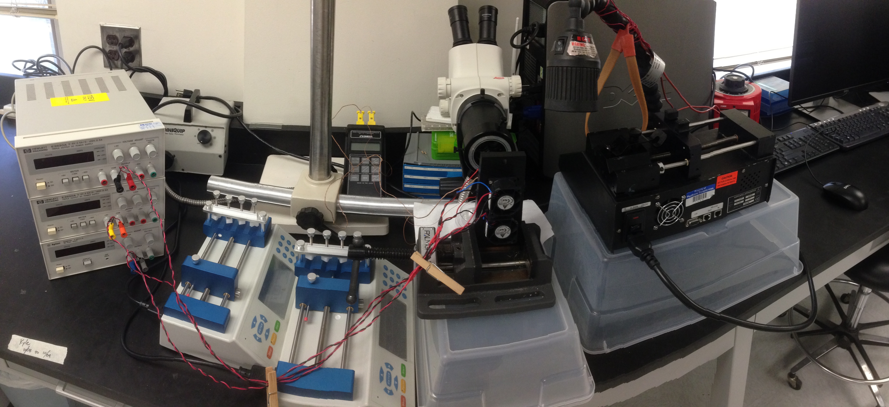

  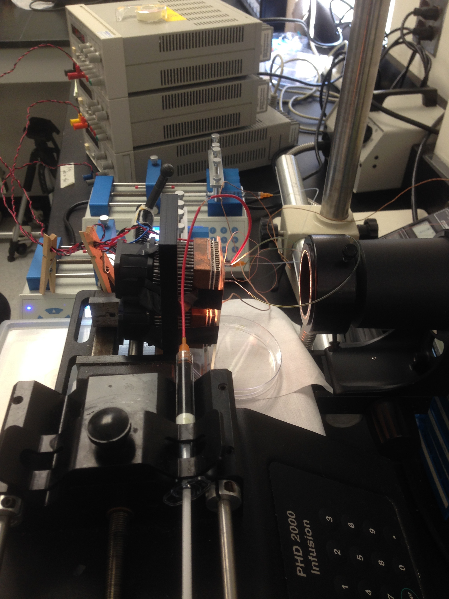

Original device setup

  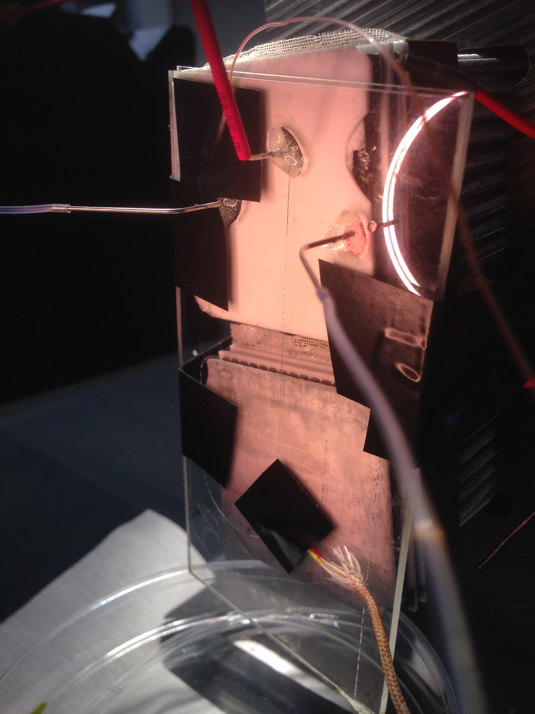

The PMMA device and camera setup

  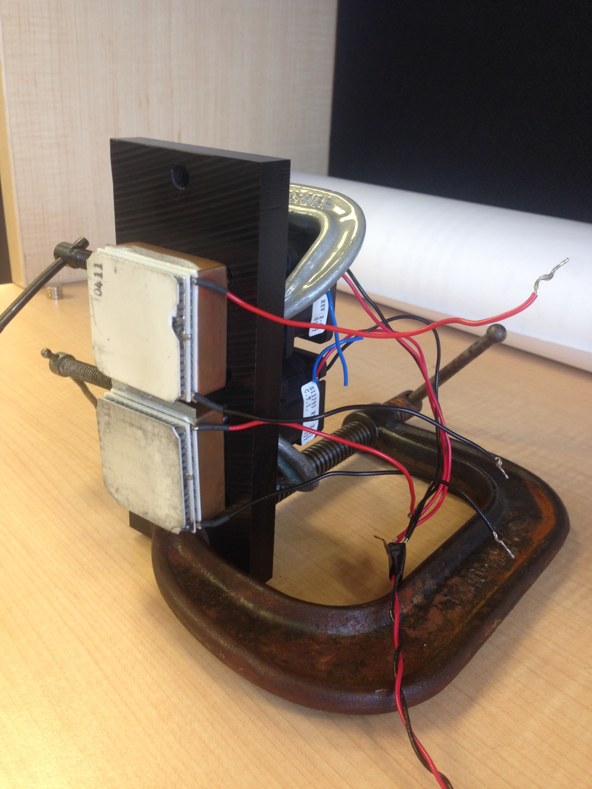

The first dual heat stage

  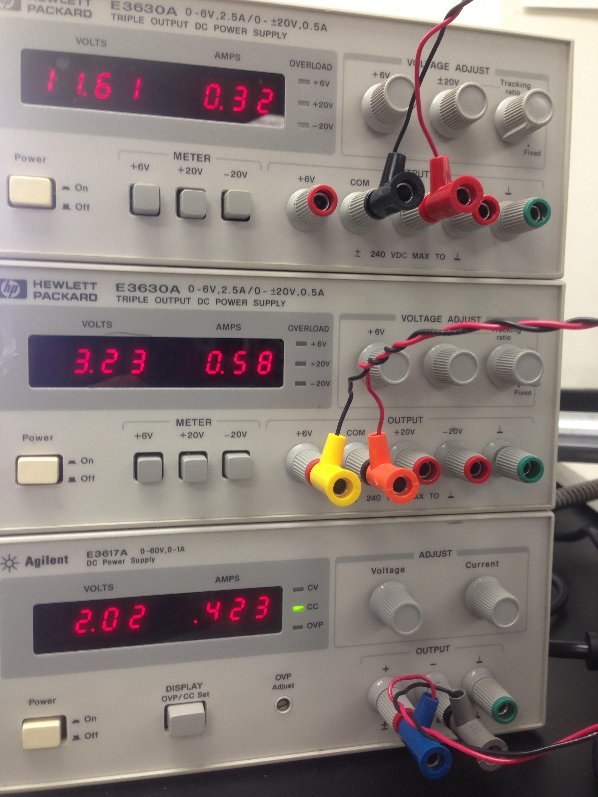

Manually monitored power supply

## Improvements

Attempting to automate the device and add controls, while improving the heat stage, I began ordering parts and testing out design changes:

  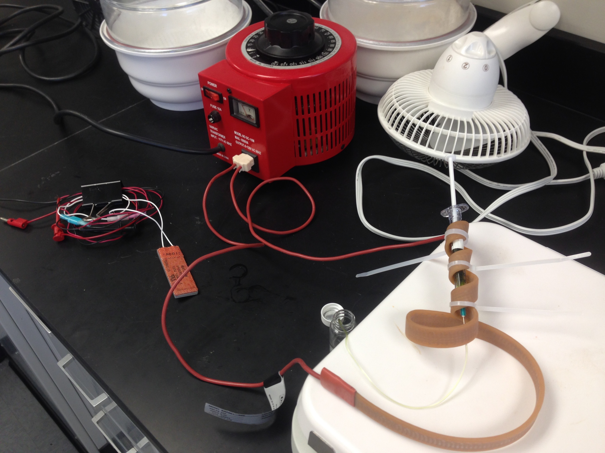

  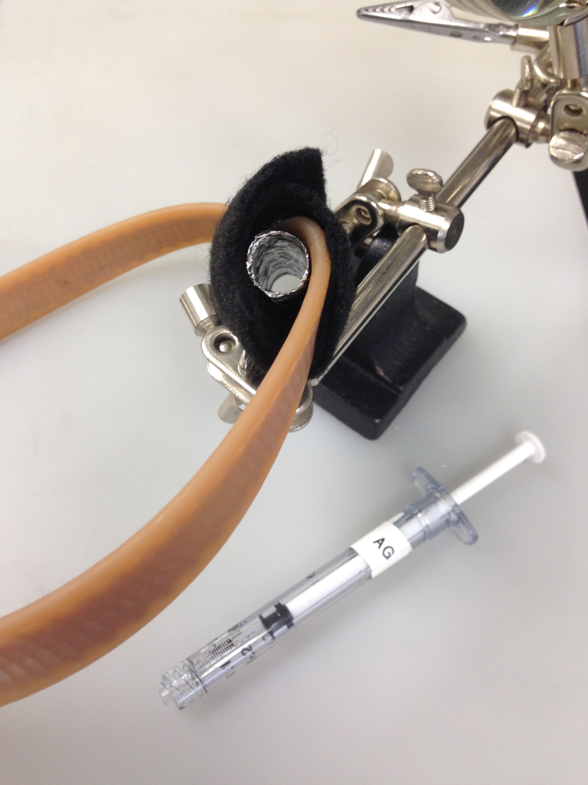

First I designed a better syringe heater using aluminum foil (to cast the shape of the syringe), heat tape, black felt for insulation (to protect the syringe pump), and plenty of electrical tape for mechanical strength

  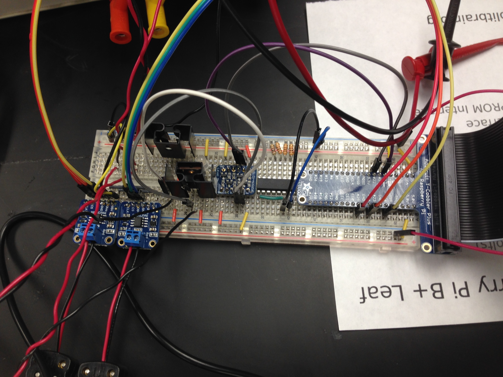

  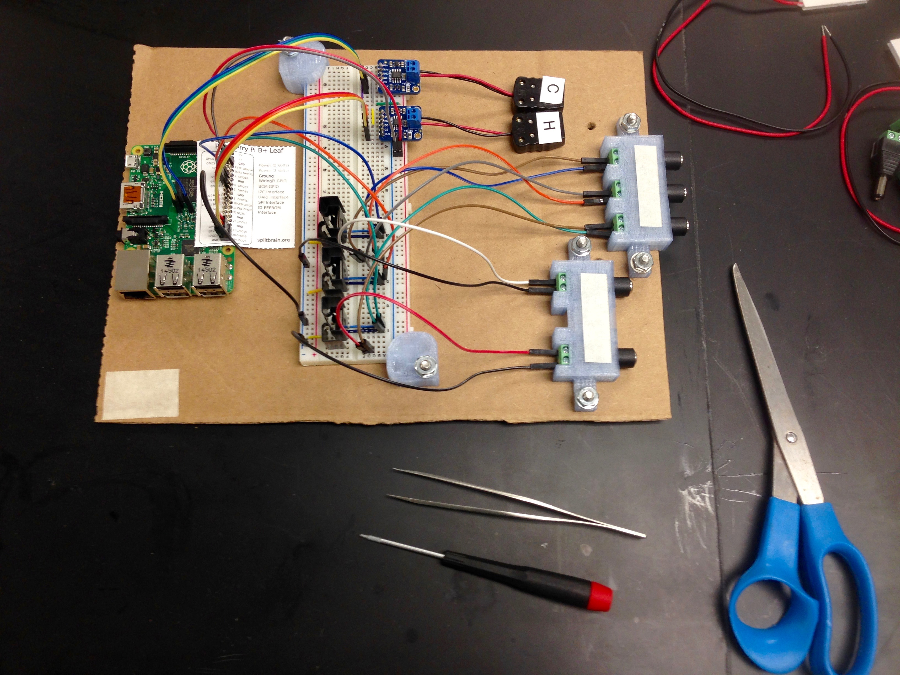

To obtain automated control, I had to play around with the electrical components. To finalize the circuit and skip the lengthy process of soldering, I mounted all of the components securely to a piece of cardboard (or it could have been a piece of plastic)

  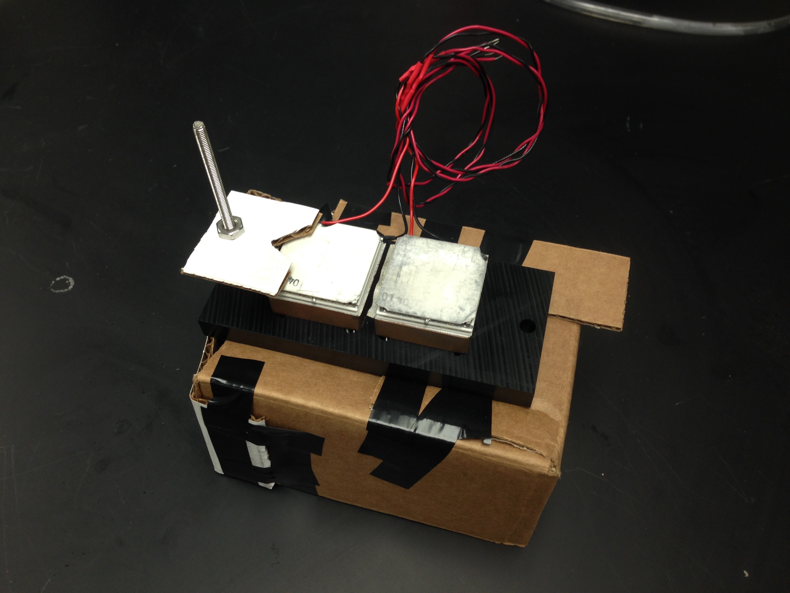

  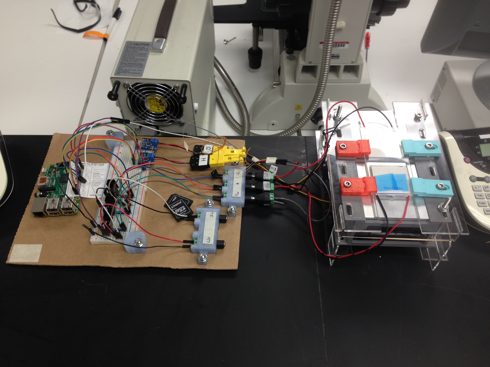

The heat stage also got a face lift. Based on the cardboard prototype, I designed a 3D printed version that could be modularly assembled and disassembled

## Final Version

Collecting all of the design improvements and modifications, i assembled a final device that could be interchangeably used for various projects.

  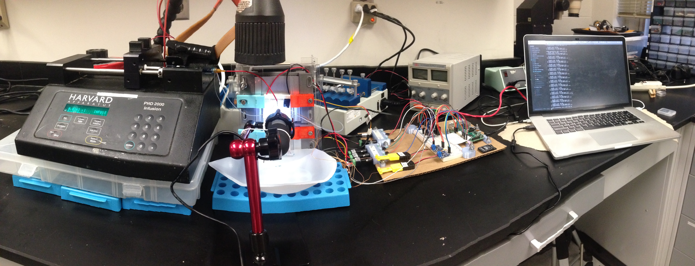

An early setup using the cardboard-mounted electronics and early versions of the controller code

  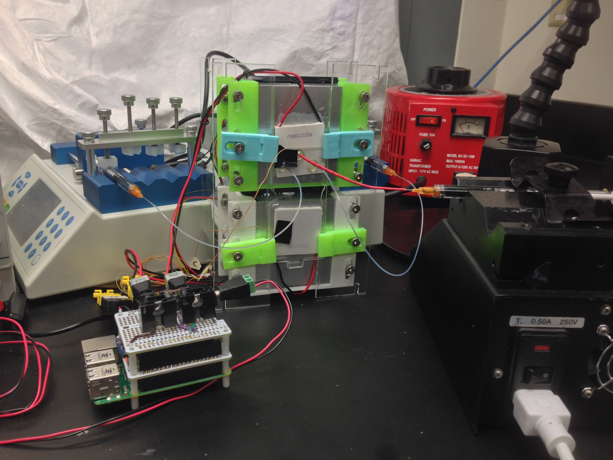

The final setup with the soldered electronic controls and compact setup

  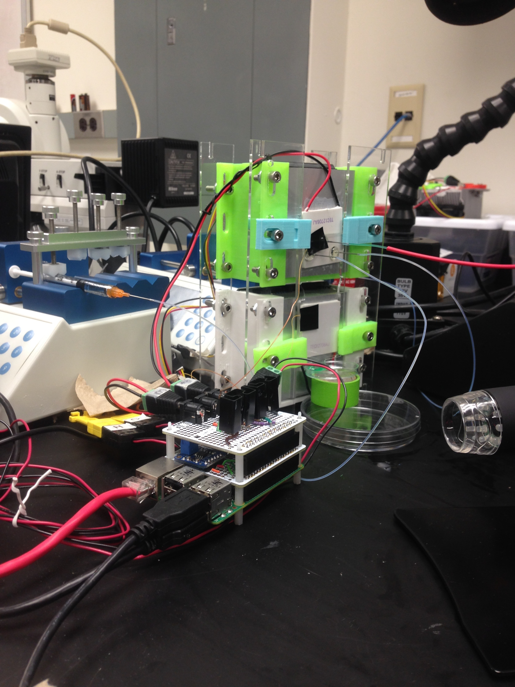

A quick candid photo of the device in use

