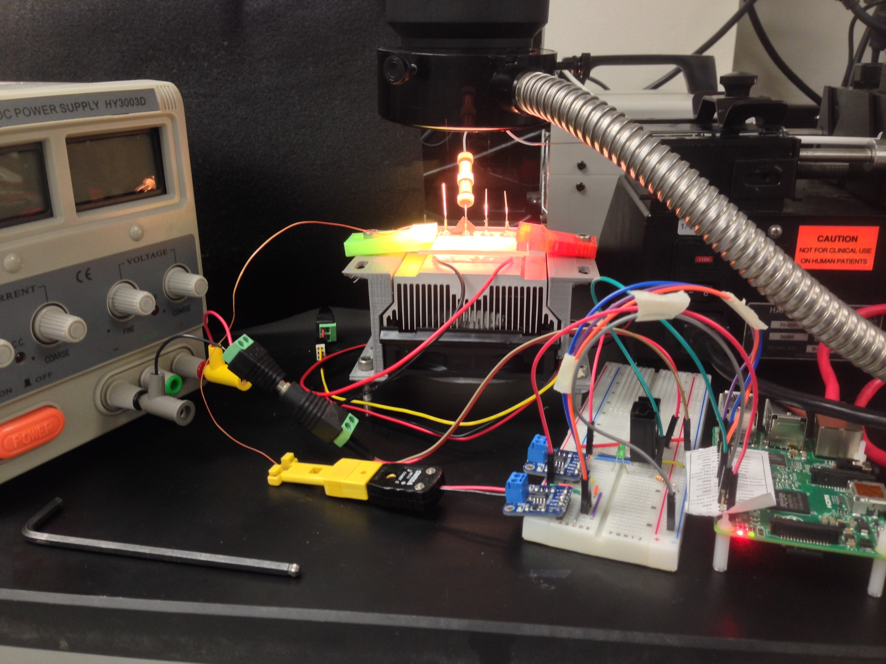

# Melter (single heat stage version of the TurtleBot)

The melter is a single heat stage from the Turtle bot, so for the 3D printed parts, `see 6_CAD-Files`, for the electronics, see `5_Electronic-Diagrams`, and for the code and operation instructions, see `4_Software/MML-HeatStage`. All videos are hosted on [Dropbox](https://www.dropbox.com/sh/8xp4immeg3l4x7x/AABkZoZxHWYwvb_Gc5XLRQq4a?dl=0) and on the Mantis post under `9_Bead-Melting-Device`.

  

  

The full Melter setup

  

Close up of the bead bed chip as it was melted

