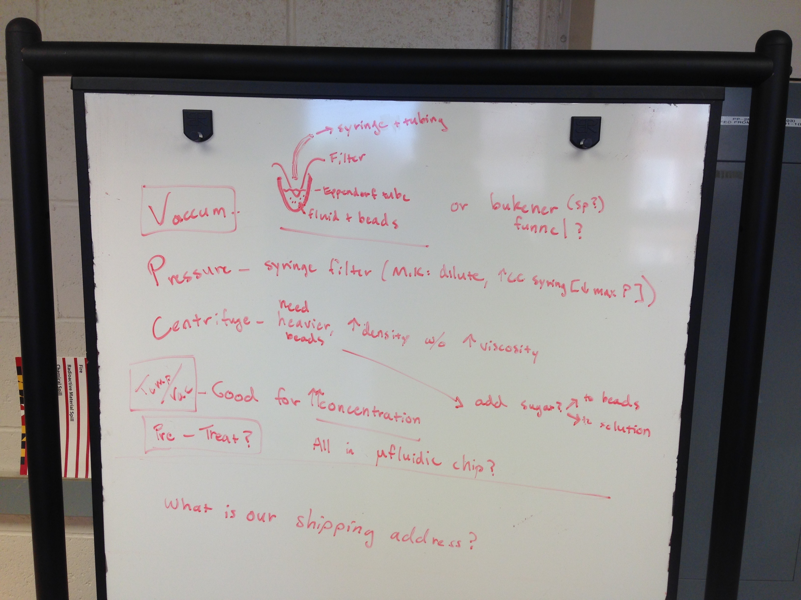

# Next Steps

So far the droplet generator works relatively well. The challenge has been to load a bead bed with the agarose beads. I've taken a couple of different approaches and looked into filtering, pre-packing the beads (silica glass beads to *seed* the bead bed), or using wells instead of a bead bed, but ran out of time to pursue these options.

I would suggest to look through literature and determine how researchers use agarose beads in filtration columns and other similar applications. Additionally, it may be worth considering a different hydrogel or adding a copolymer to the agarose beads (where both scenarios the melting temperature stays under 100°C).

To generate beads, you will need to mill a new chip. I was creating larger, plug flow droplets with the final device, but you will want to return to the optimal size droplets. Instead of making the entire exit channel the same width (~100 µm), use a larger bit (~150-200 µm) for the final 40 mm of the exit channel. You don't want to go any larger than twice the thinner section or the beads will be more likely to coalesce at the width change.

Once the bead packing step has been figured out and prototyped on the Melter heat stage, the next direction is to integrate a Fluorine-doped tin oxide (FTO) coated glass plate bonded to a PMMA chip with the microfluidic features and ports. This way the beads can be easily melted with very little energy (great for portability) and a transmission optical assay is possible.

## Where is everything?

I packed up everything into a box in the main lab (pictured below). All of the refrigerated chemicals are in the top left drawer of the main lab fridge.

  

My box contents

  

The box is located on the top of the shelving unit in the main lab

  

The bolts used are 3/16 - 24 and each drawer of the nuts, washer, and two different length bolts are labeled with masking tape

  

A few notes about potential agarose bead filtration/concentration strategies

