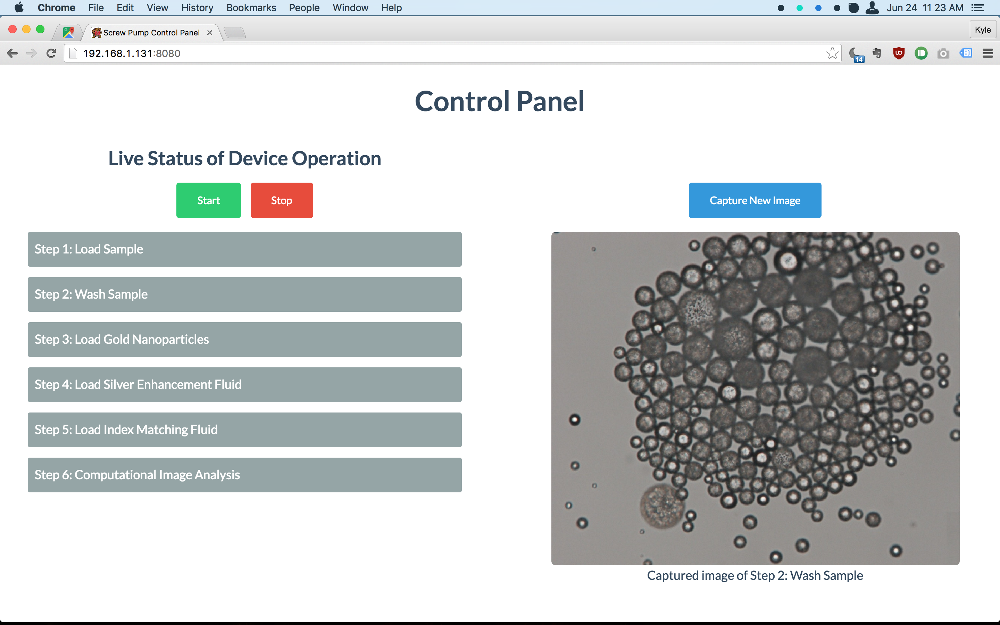

# Socket.io Controller

Built for Dr. Eric Wiederoder to operate the microfluidic screw pump device remotely and provide an intuitive user interface.

To run, use `npm install` and `node index.js`. The app will be loaded at the `network-ip-address:8080` (something like `192.168.1.162:8080`). For the specific value, see the first line of output after running `node index.js`.

Right now, this is just a demo, but it is easy to manipulate to your needs. Replace the python code in `device_operation.py` and `capture.py`. To change the text for the steps displayed, change the file, `preferences.json`.

