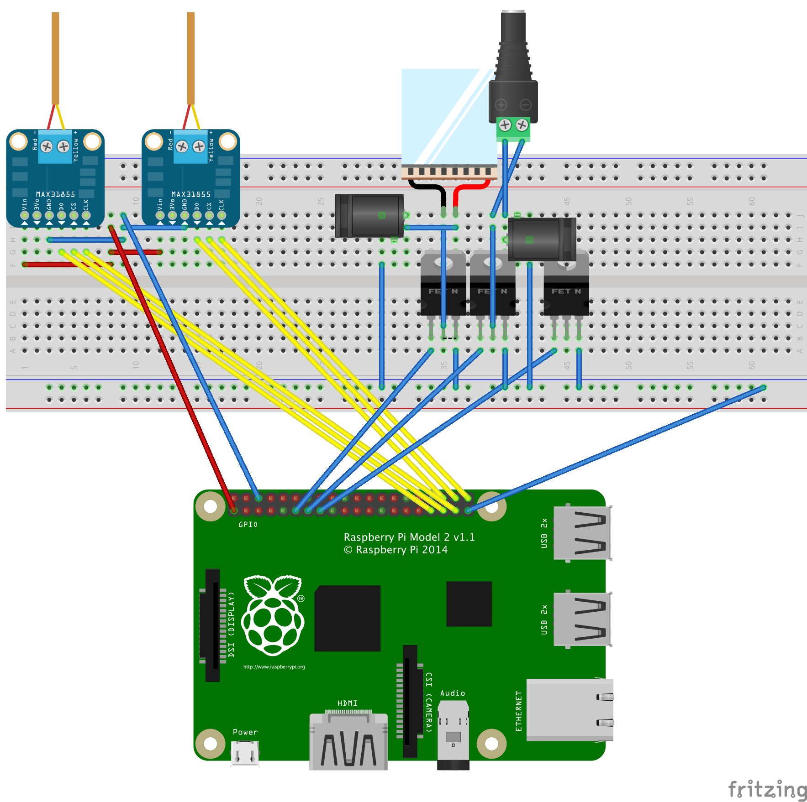
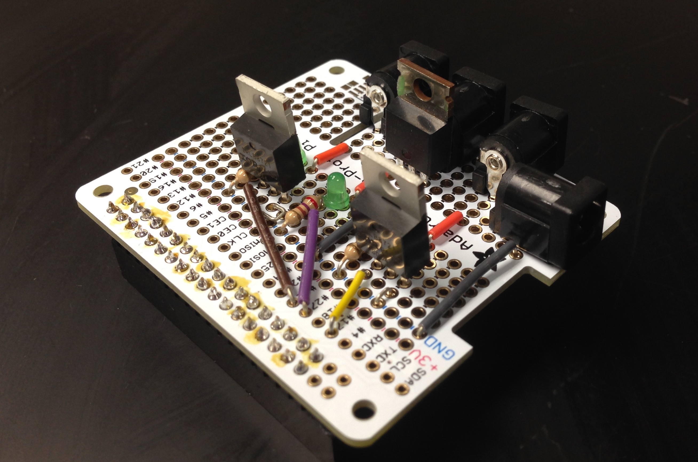
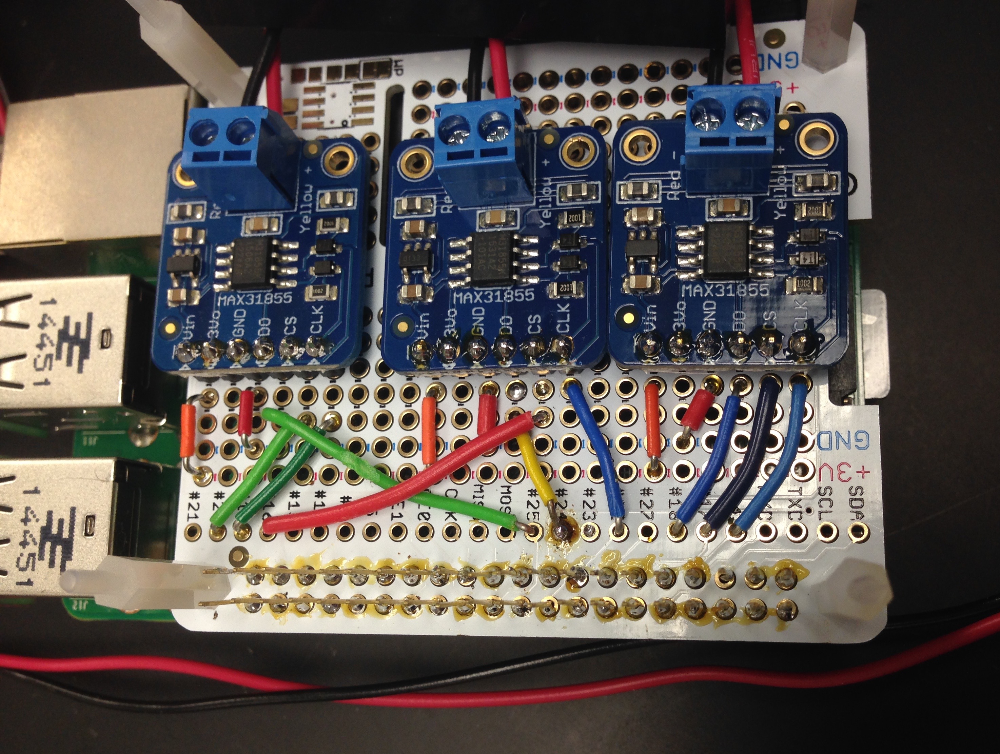
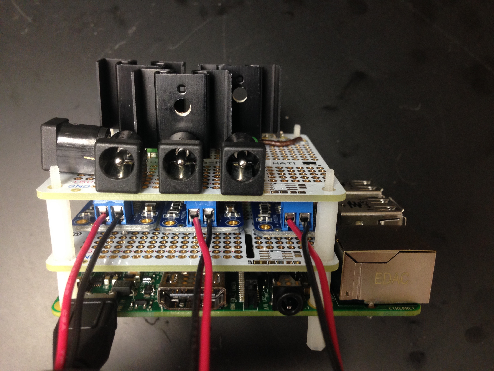
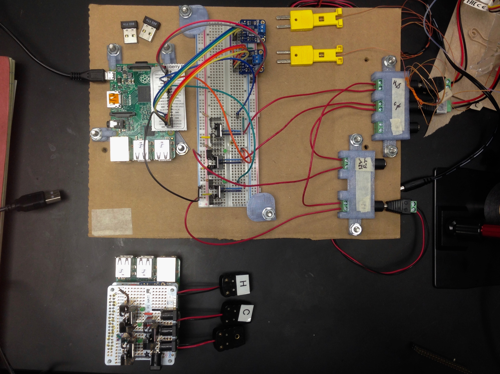

# Electronic Diagrams

## DIY Version:

Included is a [Fritzing](http://fritzing.org/home/) (`DualHeatStage---Breadboard-Version.fzz`) file for a breaboard version of the dual heat stage electronics (MOSFETs and Thermocouples). The circuit and pin numbers were changed for the soldered version and are included below.

  

Fritzing Screenshot

## Soldered Version

Pin Layout - from **Left** (closest to USB ports) to **Right** (closest to microSD slot). To switch between heating and cooling, reverse the leads or flip the tile. For my setup, I kept the bar code side face up.

- MOSFET Pins:
    + Left: 21
    + Middle: 27
    + Right: 23
- Thermocouple Pins
    + Left: pin 21
        * DO pin: 20
        * CS pin: 19
        * CLK pin: 25
    + Middle: pin 27
        * DO pin: 24
        * CS pin: 16
        * CLK pin: 22
    + Right: pin 23
        * DO pin: 18
        * CS pin: 17
        * CLK pin: 4

  

MOSFET Soldered ProtoBoard

  

Thermocouple Soldered ProtoBoard

  

Side view when both shields are stacked

  

Before and after size comparison

