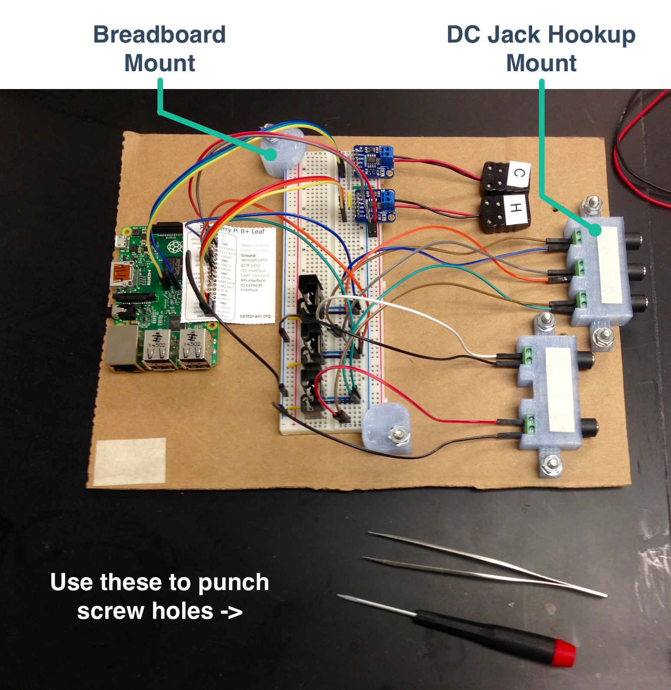
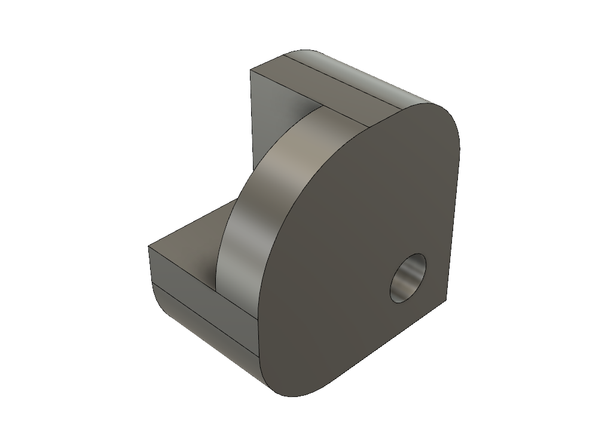

# Cardboard Prototyping Platform

Probably my favorite day hack. The breadboard was sensitive and wires could easily be pulled out. To quickly make it more robust, I printed a couple of parts and screwed them onto a piece of cardboard. Dr. Eric Kendall even used the DC Jack Adapter mounted on a piece of polycarbonate for a similar purpose. Hopefully you will find some of these files useful.

  
  <!-- <figcaption style="text-align: center;">Included 3D Parts Overview</figcaption> -->

Included 3D Parts Overview

The two parts are included as 3D files (the .stl file already includes supports and is ready for printing).

  
  <!-- <figcaption style="text-align: center;">Breadboard Mount</figcaption> -->

Breadboard Mount

  
  <!-- <figcaption style="text-align: center;">DC Jack Hookup Mount</figcaption> -->

DC Jack Hookup Mount

