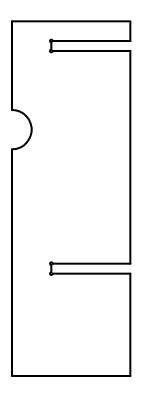

# Dual Heat Stage Parts (The Turtlebot)

  

Complete Dual Heat Stage (Turtlebot)

  

Single Cooling/Heating Stage (Melter)

  

The bolts used are 3/16 - 24 and each drawer of the nuts, washer, and two different length bolts are labeled with masking tape

## Heatsink Adapter

The Turtlebot was designed to be modular. The core component is the heatsink adapter, which has cutouts for the fan wires and bolt locations that allow for finer adjustment. When I left there were a handful printed around lab, so you shouldn't have to print anymore, but if you do there is an included .stl file ready to print.

  

The 3D Model

  

  

  

Printed Versions

## Chip Lock

A much less important piece, this one holds the microfluidic chip in place and allows for a lot of adjustability.

  

3D model

## Laser Cut Parts

There are three parts included in this folder. Make sure to see the instructions on laser cutting in [the parent folder's README.md file](https://github.com/KyleKing/AgaroseMeltingProject/tree/master/6_CAD%20Files#my-laser-cutting-process)

  

One of two back supports

  

The front support that keeps the two Peltier tiles from touching

<!-- Support -->

  

Optional: if you want to use the dual heat stage horizontally, this provides spacing for airflow behind the fans

  

The support part in use. Note the rubber band to hold it in place

